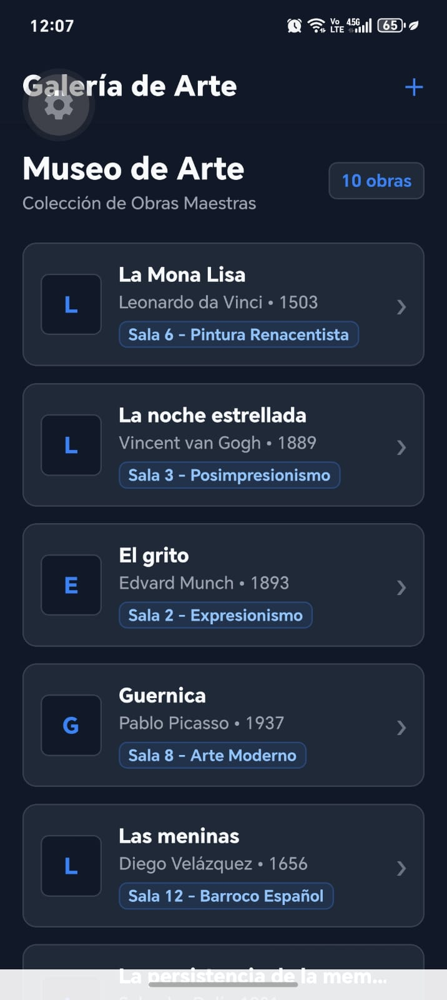
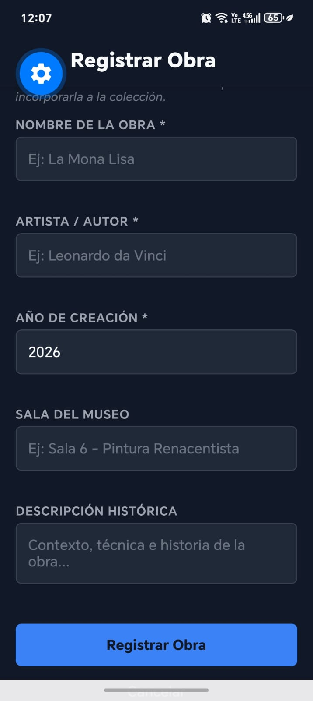

# Proyecto Semana 02 — App de Obras de Arte

## Descripción

La aplicación muestra una lista con 10 obras de arte del museo y permite buscar cualquier obra en tiempo real escribiendo su nombre en la barra de búsqueda interactiva. Los resultados se van filtrando y actualizando automáticamente a medida que el usuario escribe.

El proyecto fue realizado utilizando React Native, Expo, TypeScript y pnpm.

---

## Mi dominio

El dominio escogido para este proyecto es **Museo de Arte**.

Cada obra tiene información como:

* Nombre de la obra.
* Artista / Pintor.
* Año en que fue creada.
* Sala donde se encuentra exhibida.

Algunas de las obras incluidas son:

* La Mona Lisa.
* La noche estrellada.
* El grito.
* Guernica.
* La persistencia de la memoria.
* Las meninas.
* El nacimiento de Venus.
* La creación de Adán.
* American Gothic.
* Los girasoles.

---

## Búsqueda en tiempo real

La aplicación cuenta con una barra de búsqueda en la parte superior:

* El usuario puede escribir el nombre de una obra y la lista se filtra instantáneamente.
* Por ejemplo, si se escribe **"Mona"**, se muestra **La Mona Lisa**.
* Si no se encuentra ninguna obra que coincida con el texto ingresado, aparece un mensaje amigable indicando que no hay resultados.

---

## Pantalla principal

La pantalla principal cuenta con:

* Encabezado con el nombre del museo.
* Barra de búsqueda con icono interactivo.
* Lista de obras de arte optimizada con `FlatList`.
* Tarjetas personalizadas (`ItemCard`) con avatar, título, artista, sala y año.

---

## Capturas de pantalla

### Captura 1 — Listado de Obras


### Captura 2 — Búsqueda de Obra


---

## Diseño

Para el diseño mantuve un estilo oscuro elegante, utilizando diferentes tonos para el fondo, las tarjetas y los textos.

También utilicé el color azul claro (`#61DAFB`) para destacar nombres, insignias y elementos interactivos.

La idea fue mantener una interfaz moderna, limpia y fácil de usar para encontrar rápidamente cualquier obra de la colección.

---

## 📂 Estructura de proyecto

```text
├── 0-assets/
│   ├── cap1.jpeg
│   └── cap2.jpeg
│
├── src/
│   ├── components/
│   │   └── ItemCard.tsx
│   │
│   ├── data/
│   │   └── mockData.ts
│   │
│   ├── screens/
│   │   └── HomeScreen.tsx
│   │
│   ├── theme/
│   │   └── index.ts
│   │
│   └── types/
│       └── index.ts
│
├── app.json
├── App.tsx
├── package.json
├── pnpm-lock.yaml
└── tsconfig.json
```

Cada archivo tiene una función clara. Los datos de las obras están en `mockData.ts`, el componente reutilizable de la tarjeta en `ItemCard.tsx` y la vista principal con el buscador en `HomeScreen.tsx`.

---

## ⚙️ Cómo ejecutar el proyecto

Primero se instalan las dependencias:

```bash
pnpm install
```

Para abrirlo en el navegador web:

```bash
pnpm run web
```

Después se inicia la aplicación con Expo:

```bash
pnpm start
```

Y luego se escanea el código QR desde el celular con la aplicación **Expo Go**.

---

## ✅ Entregables realizados

* Lista con 10 obras de arte cargadas mediante `FlatList`.
* Buscador en tiempo real con `TextInput` y filtrado dinámico.
* Mensaje personalizado cuando no se encuentran resultados.
* Tarjetas modulares `ItemCard` con información de las obras.
* Diseño consistente en modo oscuro.
* Manejo adecuado del teclado y scroll.
* Proyecto tipado con TypeScript sin errores.

Proyecto realizado para la **Semana 02 — React Native**.
