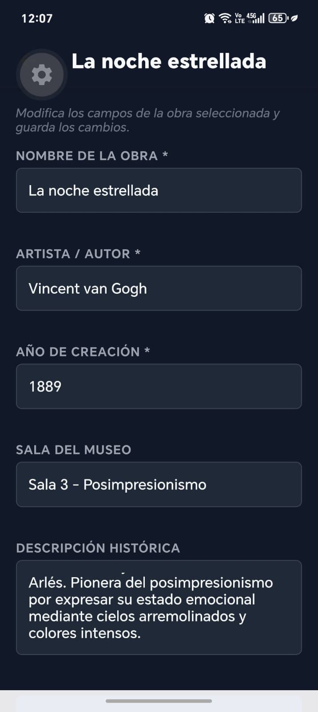

# Proyecto Semana 06 — App de Obras de Arte con Formularios y Validación Zod

## Descripción

En esta semana se construyó una aplicación móvil que utiliza **React Hook Form** y **Zod** para la gestión y validación robusta de formularios. La aplicación permite registrar nuevas obras en la colección del museo y editar obras existentes, validando los datos en tiempo real con esquemas fuertemente tipados, mostrando mensajes de error claros y conectándose a la API mediante **TanStack Query** y **Axios**.

El proyecto fue realizado utilizando React Native, Expo, TypeScript, React Hook Form, Zod, TanStack Query y pnpm.

---

## Mi dominio

El dominio escogido para este proyecto es **Museo de Arte**.

Cada obra de arte cuenta con las siguientes propiedades validadas:

* **Nombre de la obra**: Título principal de la pieza artística (requerido, máx. 80 caracteres).
* **Artista / Autor**: Creador de la obra (requerido, máx. 80 caracteres).
* **Año de creación**: Año en que fue creada (número entero positivo).
* **Sala del museo**: Ubicación física dentro del museo.
* **Técnica**: Materiales y método utilizado (ej. *Óleo sobre lienzo*).
* **Período histórico**: Movimiento artístico (ej. *Renacimiento*, *Barroco*).
* **Descripción histórica**: Contexto e información detallada de la obra.

---

## Formularios y Validación con Zod

Para el manejo y validación de datos se implementaron las mejores prácticas:

* **Esquemas Tipados con Zod (`itemSchema.ts`)**: Validación declarativa de tipos, campos obligatorios, longitudes mínimas/máximas y coerciones numéricas.
* **Inferencia automática de tipos**: Tipado estricto `ItemFormData` inferido automáticamente desde el esquema Zod sin duplicar código.
* **Componente Modular `FormField`**: Encapsula `Controller` de React Hook Form, `TextInput` nativo y visualización dinámica de mensajes de error.
* **Validación en tiempo real y al enviar**: Los errores se muestran de inmediato debajo de cada campo con formato visual destacado.
* **Formularios de Creación y Edición**:
  * **Crear (`CreateScreen`)**: Formulario limpio con valores iniciales vacíos y mutación `POST`.
  * **Editar (`EditScreen`)**: Carga automática de los datos existentes de la obra con `useItemById` y sincronización mediante `reset()` en `useEffect`.

---

## Pantallas de la app

La aplicación cuenta con navegación mediante Stack Navigator:

### 1. Pantalla Galería (Inicio - HomeScreen)
Muestra la lista de obras de arte del museo obtenidas desde la API con TanStack Query. Cada tarjeta cuenta con acciones para ver la obra, editarla o registrar una nueva obra desde el botón superior `+`.

### 2. Pantalla de Registro de Obra (CreateScreen)
Formulario controlado con React Hook Form para agregar una nueva obra al museo:
* Campos validados con Zod para nombre, artista, año, sala, técnica y descripción.
* Bloqueo del botón y spinner mientras se procesa el envío (`isSubmitting`).
* Redirección automática a la galería al completar el guardado con éxito.

### 3. Pantalla de Edición de Obra (EditScreen)
Formulario para modificar una obra existente:
* Carga previa de los datos de la obra mediante su ID.
* Permite actualizar cualquier campo manteniendo las mismas reglas de validación Zod.
* Envío de la mutación asíncrona y refresco instantáneo de la galería.

---

## Capturas de pantalla

### Captura 1 — Galería de Obras (HomeScreen)


### Captura 2 — Formulario de Registro (CreateScreen)


### Captura 3 — Formulario de Edición (EditScreen)


---

## Diseño

Para el diseño mantuve el estilo oscuro elegante de las semanas anteriores, utilizando tonos oscuros para el fondo y las tarjetas.

También utilicé el color azul claro (`#61DAFB`) para resaltar botones principales, campos activos e insignias, y color rojo suave para los mensajes de error de validación.

---

## 📂 Estructura de proyecto

```text
├── 0-assets/
│   ├── cap1.jpeg
│   ├── cap2.jpeg
│   └── cap3.jpeg
│
├── src/
│   ├── components/
│   │   └── FormField.tsx
│   │
│   ├── hooks/
│   │   └── useItems.ts
│   │
│   ├── navigation/
│   │   ├── RootNavigator.tsx
│   │   └── types.ts
│   │
│   ├── schemas/
│   │   └── itemSchema.ts
│   │
│   ├── screens/
│   │   ├── HomeScreen.tsx
│   │   ├── CreateScreen.tsx
│   │   └── EditScreen.tsx
│   │
│   ├── services/
│   │   └── api.ts
│   │
│   ├── theme/
│   │   └── index.ts
│   │
│   └── types/
│       └── index.ts
│
├── app.json
├── App.tsx
├── package.json
└── tsconfig.json
```

Cada archivo tiene una función clara. Las reglas de validación están en `schemas/itemSchema.ts`, el componente reutilizable en `components/FormField.tsx`, los hooks de conexión en `hooks/useItems.ts` y las pantallas en `screens/`.

---

## ⚙️ Cómo ejecutar el proyecto

Primero se instalan las dependencias:

```bash
pnpm install
```

Después se inicia la aplicación con Expo:

```bash
pnpm start
```

Y luego se escanea el código QR desde el celular con la aplicación **Expo Go**.

---

## ✅ Entregables realizados

* Esquema de validación Zod (`itemSchema.ts`) adaptado al dominio Museo de Arte.
* Componente reutilizable `FormField` que encapsula `Controller` + `TextInput` + errores inline.
* Pantalla `CreateScreen` con validación Zod y mutación `useCreateItem`.
* Pantalla `EditScreen` con carga de `defaultValues` (`useItemById` + `reset()`) y mutación `useUpdateItem`.
* Mensajes de error en español visibles bajo cada campo con datos inválidos.
* Estados de carga deshabilitando el botón y mostrando spinner durante `isSubmitting`.
* Diseño consistente en modo oscuro.
* Proyecto realizado con TypeScript sin errores de tipado.

Proyecto realizado para la **Semana 06 — React Native**.
