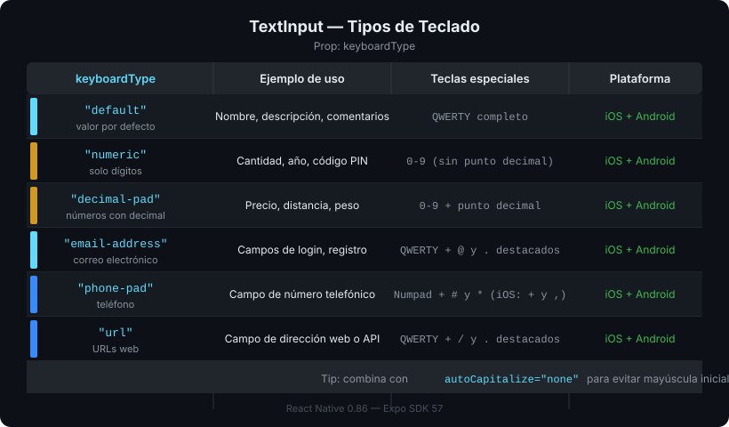

# TextInput y Manejo del Teclado

## 🎯 Objetivos

- Capturar texto del usuario con `TextInput` y sus variantes de teclado
- Manejar el teclado virtual con `KeyboardAvoidingView` para evitar que tape los inputs
- Controlar el flujo entre campos con `returnKeyType` y refs

---

## 1. TextInput — Fundamentos

En web usamos `<input>`. En React Native, todo texto ingresado pasa por `TextInput`.

```tsx
import { TextInput, View, StyleSheet } from 'react-native';
import { useState } from 'react';

export function SearchBar(): React.JSX.Element {
  const [query, setQuery] = useState('');

  return (
    <TextInput
      style={styles.input}
      // Texto controlado por estado
      value={query}
      onChangeText={setQuery}           // Se llama en cada pulsación de tecla
      placeholder="Buscar productos..."
      placeholderTextColor="#666"

      // Tipo de teclado según el contexto
      keyboardType="default"            // Ver tabla de tipos abajo

      // Botón de acción en el teclado
      returnKeyType="search"            // "done" | "next" | "go" | "search"

      // Comportamiento
      autoCorrect={false}               // Sin autocorrección (útil en búsquedas)
      autoCapitalize="none"             // "none" | "sentences" | "words" | "characters"
      clearButtonMode="while-editing"   // Solo iOS: muestra X para limpiar
    />
  );
}
```

---

## 2. Tipos de teclado



| `keyboardType` | Uso típico |
|----------------|------------|
| `"default"` | Texto general |
| `"numeric"` | Solo números (sin decimales) |
| `"decimal-pad"` | Números con punto decimal |
| `"email-address"` | Email (muestra @ y .) |
| `"phone-pad"` | Número de teléfono |
| `"url"` | URLs (muestra / y .) |

---

## 3. El problema del teclado virtual

Cuando el usuario abre el teclado, este **sube desde la parte inferior** y puede tapar los `TextInput`. Esto es especialmente problemático en formularios de login o registros con campos en la parte inferior.

```tsx
// ❌ Sin manejo del teclado — el teclado tape el input
<View style={styles.container}>
  <TextInput style={styles.input} placeholder="Email" />
  <TextInput style={styles.input} placeholder="Contraseña" />
</View>

// ✅ Con KeyboardAvoidingView — el contenido sube
import { KeyboardAvoidingView, Platform } from 'react-native';

<KeyboardAvoidingView
  style={styles.container}
  // En iOS: 'padding' agrega padding inferior
  // En Android: 'height' reduce la altura del contenedor
  behavior={Platform.OS === 'ios' ? 'padding' : 'height'}
  // keyboardVerticalOffset: ajuste si hay header de navegación
  keyboardVerticalOffset={Platform.OS === 'ios' ? 64 : 0}
>
  <TextInput style={styles.input} placeholder="Email" />
  <TextInput style={styles.input} placeholder="Contraseña" />
</KeyboardAvoidingView>
```

> **Nota**: En Android también se puede configurar `softwareKeyboardLayoutMode: "resize"` en `app.json` para que Android redimensione automáticamente el layout, evitando la necesidad de `KeyboardAvoidingView` en muchos casos.

---

## 4. Cerrar el teclado manualmente

```tsx
import { Keyboard, TouchableWithoutFeedback } from 'react-native';

// Cerrar teclado al tocar fuera del input
export function LoginForm(): React.JSX.Element {
  return (
    // TouchableWithoutFeedback no agrega feedback visual (sin ripple/opacity)
    <TouchableWithoutFeedback onPress={Keyboard.dismiss}>
      <KeyboardAvoidingView
        behavior={Platform.OS === 'ios' ? 'padding' : 'height'}
        style={styles.container}
      >
        <TextInput placeholder="Email" />
        <TextInput placeholder="Contraseña" secureTextEntry />
      </KeyboardAvoidingView>
    </TouchableWithoutFeedback>
  );
}
```

---

## 5. Navegación entre campos con refs

En formularios con múltiples campos, el usuario espera que `"Next"` en el teclado mueva el foco al siguiente input.

```tsx
import { useRef } from 'react';
import type { TextInput as TextInputType } from 'react-native';

export function RegisterForm(): React.JSX.Element {
  // Ref apunta directamente al nodo nativo del TextInput
  const emailRef = useRef<TextInputType>(null);
  const passwordRef = useRef<TextInputType>(null);

  return (
    <View>
      <TextInput
        ref={emailRef}
        placeholder="Email"
        keyboardType="email-address"
        returnKeyType="next"
        // Al presionar "Next", mueve el foco al campo contraseña
        onSubmitEditing={() => passwordRef.current?.focus()}
        blurOnSubmit={false}  // Evita que el teclado se cierre al presionar Next
      />
      <TextInput
        ref={passwordRef}
        placeholder="Contraseña"
        secureTextEntry
        returnKeyType="done"
        onSubmitEditing={Keyboard.dismiss}
      />
    </View>
  );
}
```

---

## 6. TextInput para búsqueda en FlatList

El patrón más común en aplicaciones móviles: filtrar una lista en tiempo real.

```tsx
import { useState, useMemo } from 'react';

const ALL_ITEMS = ['Manzana', 'Banana', 'Cereza', 'Durazno', 'Fresa'];

export function SearchableList(): React.JSX.Element {
  const [query, setQuery] = useState('');

  // useMemo evita recalcular el filtro en cada render no relacionado
  const filteredItems = useMemo(
    () =>
      ALL_ITEMS.filter((item) =>
        item.toLowerCase().includes(query.toLowerCase()),
      ),
    [query],
  );

  return (
    <View style={styles.container}>
      <TextInput
        value={query}
        onChangeText={setQuery}
        placeholder="Buscar..."
        style={styles.searchInput}
      />
      <FlatList
        data={filteredItems}
        keyExtractor={(item) => item}
        renderItem={({ item }) => <Text style={styles.item}>{item}</Text>}
        ListEmptyComponent={<Text style={styles.empty}>Sin resultados</Text>}
      />
    </View>
  );
}
```

---

## ✅ Checklist de verificación

- [ ] `TextInput` usa `value` + `onChangeText` (modo controlado)
- [ ] `keyboardType` apropiado para el tipo de dato esperado
- [ ] `KeyboardAvoidingView` con `behavior` diferenciado por plataforma
- [ ] `Keyboard.dismiss()` accesible (tap fuera o botón "Done")
- [ ] En formularios multi-campo: `refs` para navegar con "Next"

## 📚 Recursos adicionales

- [TextInput — React Native docs](https://reactnative.dev/docs/textinput)
- [KeyboardAvoidingView — React Native docs](https://reactnative.dev/docs/keyboardavoidingview)
- [Keyboard — React Native docs](https://reactnative.dev/docs/keyboard)
