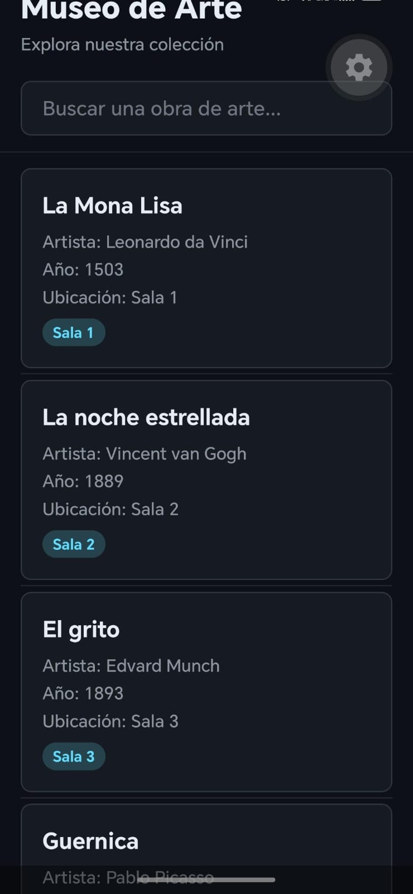
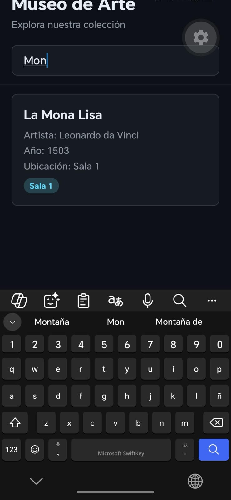

# Proyecto Semana 02 — App de Obras de Arte

##  Descripción

La aplicación muestra una lista con 10 obras de arte y permite buscar una obra escribiendo su nombre en el buscador. Los resultados van cambiando a medida que se escribe.

El proyecto fue realizado utilizando React Native, Expo y TypeScript.

---

##  Mi dominio

El dominio escogido para este proyecto es **Museo de Arte**.

Cada obra tiene información como:

* Nombre de la obra.
* Artista.
* Año en que fue creada.
* Sala donde se encuentra.

Algunas de las obras incluidas son:

* La Mona Lisa.
* La noche estrellada.
* El grito.
* Guernica.
* La persistencia de la memoria.
* Las meninas.
* El nacimiento de Venus.
* La creación de Adán.
* American Gothic.
* Los girasoles.

---

##  Búsqueda

La aplicación tiene un buscador en la parte superior.

El usuario puede escribir el nombre de una obra y la aplicación muestra las que coinciden con la búsqueda.

Por ejemplo, si se escribe:

**Mona**

se muestra:

**La Mona Lisa**

Si no se encuentra ninguna obra, aparece un mensaje indicando que no hay resultados.

---

##  Pantalla principal

La pantalla principal cuenta con:

* El nombre del museo.
* Un buscador.
* La lista de obras de arte.
* Tarjetas con la información de cada obra.

## Captura de pantalla

### Captura 1 Listado de Oras
 

### Captura 2 Busqueda de Obra


---

##  Diseño

Para el diseño escogí un estilo oscuro, utilizando diferentes tonos para el fondo, las tarjetas y los textos.

También utilicé un color azul claro para destacar algunos elementos de la aplicación.

La idea fue mantener un diseño sencillo y fácil de entender para que el usuario pueda encontrar rápidamente una obra.

---

## 📂 Estructyra de proyecto

```text
week-02-listas_inputs_y_estilos/
│
├── README.md
├── rubrica-evaluacion.md
│
├── 0-assets/
│   ├── 01-flatlist-virtualization.svg
│   └── 02-keyboard-types.svg
│
├── 1-teoria/
│   ├── 01-flatlist-sectionlist.md
│   ├── 02-textinput-teclado.md
│   └── 03-estilos-dinamicos.md
│
├── 2-practicas/
│   │
│   ├── ejercicio-01-flatlist-basica/
│   │   └── README.md
│   │
│   └── ejercicio-02-busqueda-input/
│       └── README.md
│
├── 3-proyecto/
│   ├── README.md
│   │
│   └── starter/
│       ├── src/
│       │   ├── components/
│       │   │   └── ItemCard.tsx
│       │   │
│       │   ├── data/
│       │   │   └── mockData.ts
│       │   │
│       │   ├── screens/
│       │   │   └── HomeScreen.tsx
│       │   │
│       │   ├── theme/
│       │   │   └── index.ts
│       │   │
│       │   └── types/
│       │       └── index.ts
│       │
│       ├── app.json
│       ├── App.tsx
│       ├── package.json
│       ├── pnpm-lock.yaml
│       ├── tsconfig.json
│       └── README.md
│
├── 4-recursos/
│   ├── ebooks-free/
│   ├── videografia/
│   └── webgrafia/
│
└── 5-glosario/
    └── README.md
```

Cada carpeta tiene una función diferente. Por ejemplo, los datos de las obras están en `mockData.ts`, mientras que la pantalla principal está en `HomeScreen.tsx`.

---

## ⚙️ Cómo ejecutar el proyecto

Primero se instalan las dependencias:

```bash
pnpm install
```

Después se inicia la aplicación:

```bash
pnpm start
```

---

## ✅ Entregables realizados

*  Lista con 10 obras de arte.
*  Buscador funcionando.
*  Resultados actualizados mientras se escribe.
*  Mensaje cuando no se encuentran resultados.
*  Tarjetas con información de las obras.
*  Diseño oscuro.
*  Manejo del teclado.
*  Proyecto realizado con TypeScript.

Proyecto realizado para la **Semana 02 — React Native**.


