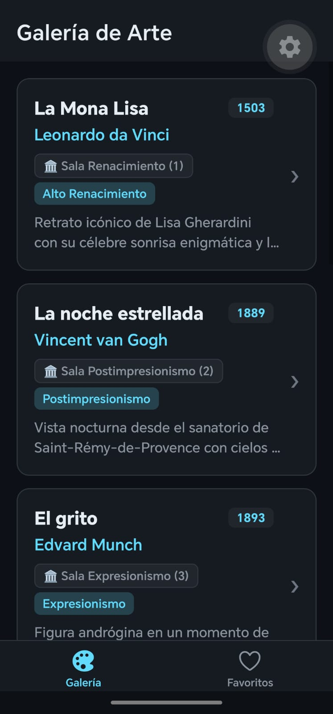
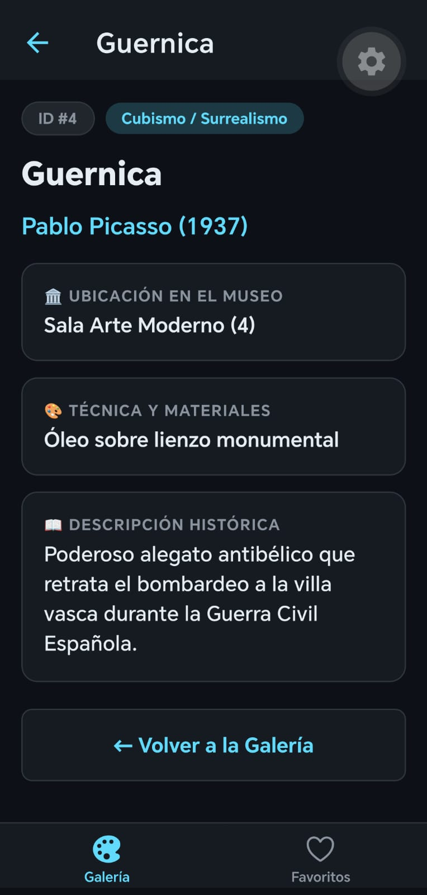
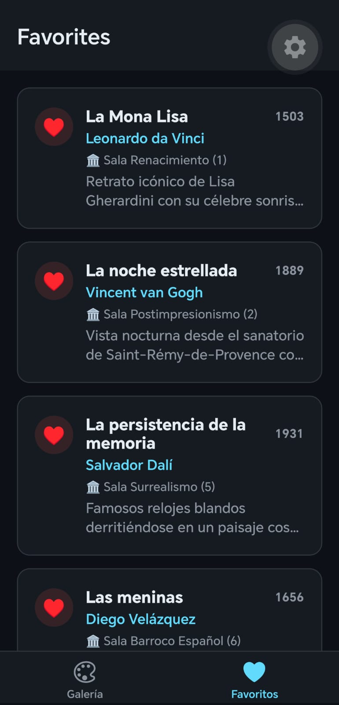

# Proyecto Semana 03 — App de Obras de Arte con Navegación

## Descripción

En esta semana se construyó una aplicación móvil con **React Navigation 7** para navegar entre varias pantallas. La aplicación cuenta con una barra de navegación en la parte inferior con dos pestañas (**Galería** y **Favoritos**) y permite entrar al detalle de cada obra de arte tocándola desde la lista principal.

El proyecto fue realizado utilizando React Native, Expo, TypeScript y pnpm.

---

## Mi dominio

El dominio escogido para este proyecto es **Museo de Arte**.

Cada obra tiene información como:

* Nombre de la obra.
* Artista.
* Año en que fue creada.
* Sala donde se encuentra.
* Descripción de la obra.

Algunas de las obras incluidas son:

* La Mona Lisa.
* La noche estrellada.
* El grito.
* Guernica.
* La persistencia de la memoria.
* Las meninas.
* El nacimiento de Venus.
* La creación de Adán.

---

## Navegación de la app

La aplicación cuenta con dos pestañas en la barra inferior y navegación a detalle:

### 1. Pestaña Galería (Inicio)
Muestra el catálogo completo de las obras de arte en tarjetas con el nombre de la obra, el artista, el año, la sala y una vista previa. Al tocar cualquier obra, se abre la pantalla de detalle.

### 2. Pantalla de Detalle de la Obra
Muestra toda la ficha técnica de la obra seleccionada:
* Nombre y artista con el año.
* Sala donde está exhibida.
* Técnica utilizada.
* Descripción histórica completa.
* Un botón para volver a la galería.

El título en la barra superior cambia automáticamente al nombre de la obra seleccionada.

### 3. Pestaña Favoritos
Muestra una lista especial con las obras favoritas del museo, identificadas con un icono de corazón y los datos principales de cada una.

---

## Capturas de pantalla

### Captura 1 — Lista de Obras (Galería)


### Captura 2 — Detalle de una Obra


### Captura 3 — Pestaña de Favoritos


---

## Diseño

Para el diseño mantuve el estilo oscuro de las semanas anteriores, utilizando tonos oscuros para el fondo y las tarjetas.

También utilicé el color azul claro (`#61DAFB`) para resaltar nombres, insignias y elementos activos de la barra de navegación.

La barra de pestañas inferior tiene iconos interactivos que cambian cuando una pestaña está seleccionada.

---

## 📂 Estructura de proyecto

```text
week-03-react_navigation/
│
├── README.md
├── rubrica-evaluacion.md
│
├── 0-assets/
│   ├── 01-navigation-stack-flow.svg
│   └── 02-navigator-types.svg
│
├── 1-teoria/
│   ├── 01-stack-navigator.md
│   ├── 02-tab-navigator.md
│   └── 03-drawer-navegacion-anidada.md
│
├── 2-practicas/
│   ├── ejercicio-01-stack-navigator/
│   │   ├── README.md
│   │   └── starter/
│   │       ├── App.tsx
│   │       └── package.json
│   │
│   └── ejercicio-02-tabs-stack/
│       ├── README.md
│       └── starter/
│           ├── App.tsx
│           └── package.json
│
├── 3-proyecto/
│   ├── README.md
│   │
│   └── starter/
│       ├── src/
│       │   ├── data/
│       │   │   └── mockData.ts
│       │   │
│       │   ├── navigation/
│       │   │   ├── RootNavigator.tsx
│       │   │   └── types.ts
│       │   │
│       │   ├── screens/
│       │   │   ├── HomeScreen.tsx
│       │   │   ├── DetailScreen.tsx
│       │   │   └── FavoritesScreen.tsx
│       │   │
│       │   ├── theme/
│       │   │   └── index.ts
│       │   │
│       │   └── types/
│       │       └── index.ts
│       │
│       ├── app.json
│       ├── App.tsx
│       ├── package.json
│       └── tsconfig.json
│
├── 4-recursos/
│   ├── ebooks-free/
│   ├── videografia/
│   └── webgrafia/
│
└── 5-glosario/
    └── README.md
```

Cada archivo tiene una función clara. Los datos de las obras están en `mockData.ts`, la configuración de las rutas y pestañas está en `RootNavigator.tsx` y cada vista tiene su archivo en la carpeta `screens`.

---

## ⚙️ Cómo ejecutar el proyecto

Primero se entra a la carpeta del proyecto y se instalan las dependencias:

```bash
cd 3-proyecto/starter
pnpm install
```

Después se inicia la aplicación con Expo:

```bash
pnpm start
```

Y luego se escanea el código QR desde el celular con la aplicación **Expo Go**.

---

## ✅ Entregables realizados

* Ejercicio 01 (Stack Navigator) completado y funcionando.
* Ejercicio 02 (Tabs + Stack anidado) completado y funcionando.
* Proyecto final con Tab Navigator (Galería y Favoritos).
* Navegación de lista a detalle pasando los datos de la obra.
* Botón para regresar a la lista de obras.
* Barra de navegación inferior con iconos interactivos.
* Diseño en modo oscuro consistente con las semanas anteriores.
* Proyecto realizado con TypeScript sin errores de tipado.

Proyecto realizado para la **Semana 03 — React Native**.
