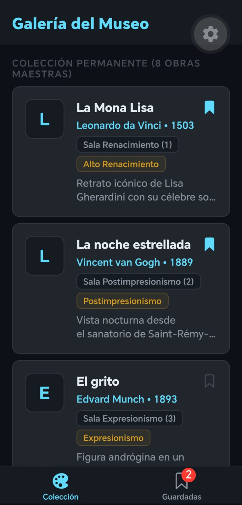
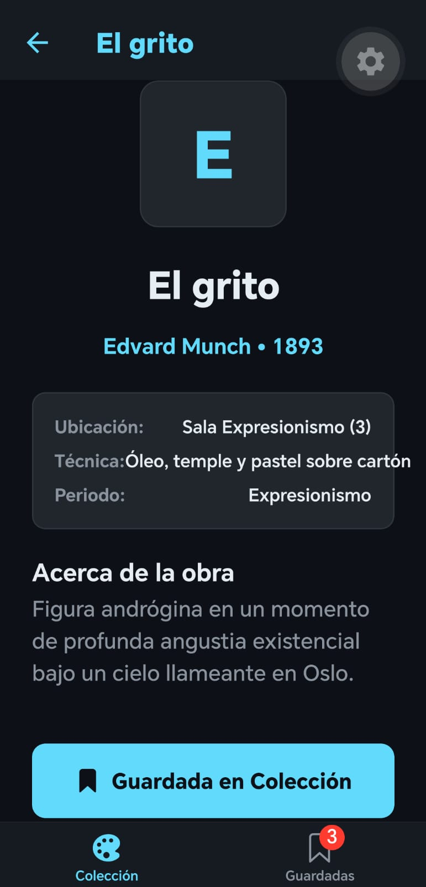
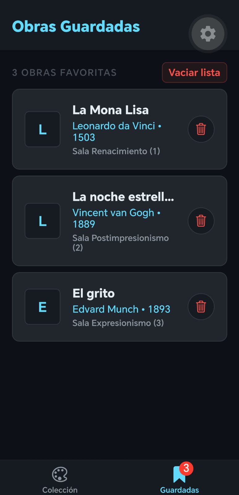

# Proyecto Semana 04 — App de Obras de Arte con Estado Global

## Descripción

En esta semana se construyó una aplicación móvil que utiliza **Zustand** para manejar el estado global de la aplicación. Esto permite que las obras que el usuario guarde como favoritas se sincronicen automáticamente en toda la app, actualicen el contador de la barra de navegación en tiempo real y no se borren al cerrar la aplicación gracias al almacenamiento local con AsyncStorage.

El proyecto fue realizado utilizando React Native, Expo, TypeScript, Zustand y pnpm.

---

## Mi dominio

El dominio escogido para este proyecto es **Museo de Arte**.

Cada obra tiene información como:

* Nombre de la obra.
* Artista.
* Año en que fue creada.
* Sala donde se encuentra.
* Técnica utilizada.
* Periodo artístico.
* Descripción de la obra.

Algunas de las obras incluidas son:

* La Mona Lisa.
* La noche estrellada.
* El grito.
* Guernica.
* La persistencia de la memoria.
* Las meninas.
* El nacimiento de Venus.
* La creación de Adán.

---

## Estado Global y Favoritos

Para manejar la información de las obras guardadas se utilizó **Zustand**, creando un almacén (*store*) global que permite:

* **Guardar en favoritos**: Agregar una obra a la lista personal sin que se duplique.
* **Quitar de favoritos**: Eliminar una obra de la lista desde el detalle, desde la galería o desde la pestaña de guardados.
* **Vaciar lista**: Borrar todas las obras guardadas con un solo botón.
* **Persistencia**: Las obras guardadas se mantienen guardadas en el teléfono incluso si se cierra y se vuelve a abrir la app.
* **Contador en vivo**: El icono de la pestaña de favoritos muestra un número con la cantidad de obras guardadas en tiempo real.

---

## Pantallas de la app

La aplicación cuenta con dos pestañas en la barra inferior y navegación a detalle:

### 1. Pestaña Galería (Colección)
Muestra el catálogo completo de las obras del museo en tarjetas con su nombre, artista, año, sala y periodo. Cada tarjeta cuenta con un botón rápido para guardarla directamente en favoritos y al tocar la tarjeta se abre la pantalla de detalle.

### 2. Pantalla de Detalle de la Obra
Muestra toda la ficha técnica de la obra seleccionada:
* Nombre y artista con el año.
* Sala donde está exhibida, técnica y periodo.
* Descripción histórica completa.
* Un botón para **Guardar en Favoritos** o **Quitar de Favoritos** que actualiza el estado de la app al instante.

### 3. Pestaña Guardadas (Favoritos)
Muestra la lista de obras que el usuario ha guardado como favoritas. Permite eliminar obras de forma individual o vaciar toda la lista. Si no hay obras guardadas, muestra un mensaje invitando al usuario a explorar la galería.

---

## Capturas de pantalla

### Captura 1 — Lista de Obras (Home)


### Captura 2 — Detalle de una Obra (Detail)


### Captura 3 — Pestaña de Guardadas (Saved)


---

## Diseño

Para el diseño mantuve el estilo oscuro de las semanas anteriores, utilizando tonos oscuros para el fondo y las tarjetas.

También utilicé el color azul claro (`#61DAFB`) para resaltar nombres, botones, insignias y elementos activos de la barra de navegación.

La barra de pestañas inferior tiene iconos interactivos de la librería `Ionicons` que cambian cuando una pestaña está seleccionada y muestran el número de obras guardadas.

---

## 📂 Estructura de proyecto

```text
week-04-estado_global_zustand/
│
├── README.md
├── rubrica-evaluacion.md
│
├── 0-assets/
│   ├── 01-zustand-store-flow.svg
│   └── 02-zustand-vs-context.svg
│
├── 1-teoria/
│   ├── 01-zustand-fundamentos.md
│   └── 02-zustand-slices-persist.md
│
├── 2-practicas/
│   ├── ejercicio-01-store-basico/
│   │   ├── README.md
│   │   └── starter/
│   │       ├── App.tsx
│   │       ├── package.json
│   │       └── tsconfig.json
│   │
│   └── ejercicio-02-persist-middleware/
│       ├── README.md
│       └── starter/
│           ├── App.tsx
│           ├── package.json
│           └── tsconfig.json
│
├── 3-proyecto/
│   ├── README.md
│   │
│   └── starter/
│       ├── src/
│       │   ├── data/
│       │   │   └── mockData.ts
│       │   │
│       │   ├── navigation/
│       │   │   ├── RootNavigator.tsx
│       │   │   └── types.ts
│       │   │
│       │   ├── screens/
│       │   │   ├── HomeScreen.tsx
│       │   │   ├── DetailScreen.tsx
│       │   │   └── SavedScreen.tsx
│       │   │
│       │   ├── stores/
│       │   │   └── savedStore.ts
│       │   │
│       │   ├── theme/
│       │   │   └── index.ts
│       │   │
│       │   └── types/
│       │       └── index.ts
│       │
│       ├── app.json
│       ├── App.tsx
│       ├── package.json
│       └── tsconfig.json
│
├── 4-recursos/
└── 5-glosario/
```

Cada archivo tiene una función clara. Los datos de las obras están en `mockData.ts`, el estado global está en `savedStore.ts`, la navegación en `RootNavigator.tsx` y las vistas en la carpeta `screens`.

---

## ⚙️ Cómo ejecutar el proyecto

Primero se entra a la carpeta del proyecto y se instalan las dependencias:

```bash
cd 3-proyecto/starter
pnpm install
```

Para abrirlo en el navegador web:

```bash
pnpm run web
```

Después se inicia la aplicación con Expo:

```bash
pnpm start
```

Y luego se escanea el código QR desde el celular con la aplicación **Expo Go**.

---

## ✅ Entregables realizados

* Ejercicio 01 (Store básico con contador y tareas) completado y funcionando.
* Ejercicio 02 (Persistencia con AsyncStorage) completado y funcionando.
* Proyecto final con Tab Navigator (Galería y Guardadas).
* Store global con Zustand para manejar favoritos compartido entre pantallas.
* Contador numérico en la barra inferior actualizado en tiempo real.
* Navegación de lista a detalle pasando los datos de la obra.
* Botón interactivo para guardar y quitar obras de favoritos.
* Persistencia para mantener las obras guardadas al cerrar la app.
* Capturas de pantalla de Home, Detail y Saved screens añadidas.
* Diseño en modo oscuro consistente con las semanas anteriores.
* Proyecto realizado con TypeScript sin errores de tipado.

Proyecto realizado para la **Semana 04 — React Native**.


